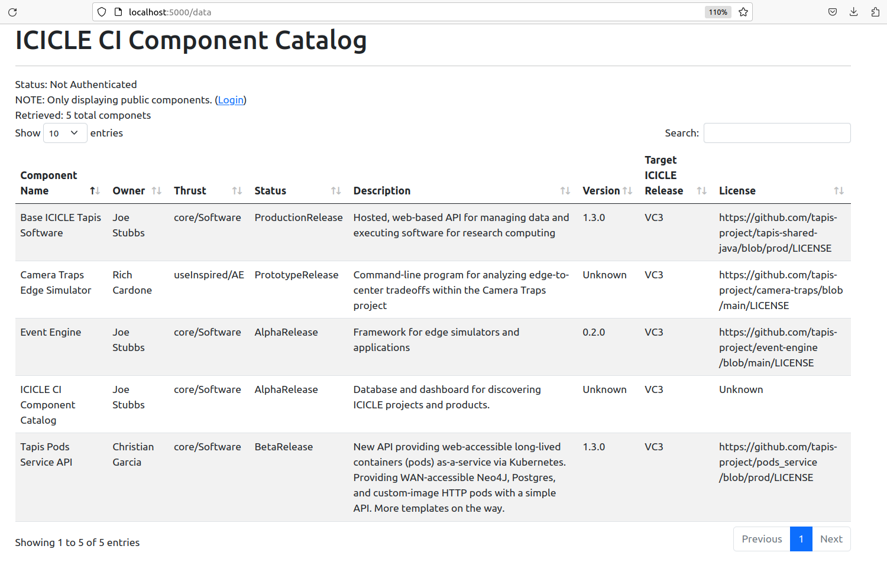

# CI Components Catalog

## Introduction

This repository contains metadata and code for the ICICLE CI Components Catalog. The CI Components Catalog tracks all major
products developed by the ICICLE AI Institute. Using the Catalog, members within ICICLE as well as their collaborators and
the general public can learn about the products being produced. 

## ICICLE Software Releases

The release of ICICLE CI components, including software components, are tracked in this component catalog. In order for 
a component to be included in a release, the following high-level steps must be performed:

1. Write a component definition for the component to be released. This definition should conform to the CI 
   Component Catalog Schema. Descriptions for all the attributes in the schema are available from the LinkML
   file [here](https://github.com/ICICLE-ai/CI-Components-Catalog/blob/master/ci-component.yaml#L74) and some 
   guidelines for some specific attributes are included in the subsequent section.
2. Engage the ICICLE Release Team to discuss your component and work out a validation plan, preferably at one of the regular ICICLE Component Release meetings.
3. Be available for feedback from the Release Team. Feedback could include issues with accessing the component or
  source code, building/installation issues, failing tests, etc. 
4. Make any necessary modifications to the component
before the release date.
5. Add the following snippit to your Readme.md file and include all NSF funding resources that were used for your component.

'''markdown
# Acknowledgements

*This work has been funded by grants from the National Science Foundation, including the ICICLE AI Institute (OAC 2112606)
'''

### Guidelines on Specific Component Attributes 

Many of the fields in the Component schema are self-explanatory, e.g., ``name``, ``description``, ``owner``, etc. In this section we provide additional guidance on specific fields.

``licenseUrl``: It is important that the team developing the 
component identify the license that will be used. Ideally, this
license would be available on some URL (e.g., a URL associated 
with the git repository for the project).

``testsWritten``: Whether automated tests have been written. These should be included for releases at the alpha level and above (see ``status`` below).

``sourceCodeUrl``: A URL to a repository where the component 
source is hosted. When possibly, we recommend using the [ICICLE GitHub project](https://github.com/ICICLE-ai) to host the repository. 

 ``status``: This field tracks the maturity of the 
 component. Here are some guidelines for each of the possible values:
  -  ``Unreleased``: This value should not be used for components
    that will be included in a release.
  - ``PrototypeRelease``: Prototype components are minimal working examples that may be lacking in robustness, reliability, or other quality aspects. They likely target only one or a minimal number of use cases.
  - ``AlphaRelease``: Alpha components have matured beyond the prototype phase to provide more reliability. The inclusion of tests and some usage documentation should be provided for all alpha components. Minor bugs and other defects may exist. Typically, alpha components have been designed to generalize beyond a single use case, though interface changes are expected as the component gets usage and additional generalizations are identified. 
  - ``BetaRelease``: Beta components have matured beyond the alpha phase and should include automated tests, user documentation and support for multiple use cases. Interfaces/APIs for beta components should be considered "mostly" stable (e.g., already designed for multiple use cases) -- that is, stable baring some unexpected discovery during usage after the release. The component may exhibit failures under heavy load, scalability limits, or other minor defects/limitations, but should otherwise have no known issues.
  - ``ProductionRelease``: Production components have matured beyond the beta phase to be hardened, defect free and highly scalability solutions. The interfaces/APIs should be stable with breaking changes only introduced as part of subsequent releases that include a plan for upgrades and/or backward compatibility. High-quality user documentation should be publicly available. 

## Catalog Schema

We are using LinkML and JSONSchema to describe the data model associated with components in the catalog. 
The JSONSchema document can be generated from the LinkML yaml document by doing the following:

```
$ docker run -v $(pwd):/work  -w /work/ --rm -it jstubbs/linkml gen-json-schema ci-component.yaml

```

You can test the schema by validating the local example dataset ``components-data.yaml``, 
included in the repository, by doing the following:

```
docker run -v $(pwd):/work  -w /work/ --rm -it jstubbs/linkml linkml-validate -s ci-component.yaml components-data.yaml
```

If no errors are returned, the message ``None`` will be output. 


## Deploying the Catalog Locally

A simple prototype application is being developed with Flask and Docker. You need to install
Docker on your computer before trying to run the application locally. See the [Docker 
documentation](https://docs.docker.com/get-docker/) for information about how to get Docker on your platform.

You can deploy the prototype locally using one of the following methods:

### Using Make

If you have GNU make on your computer, issuing the following command should build the
application image and start the container in one go:

```
make run
```


### Building with Docker

One can build the container image using a command such as:

```
docker build -t tapis/ci-catalog .
```

With the image build, start the application using:

```
docker run --name catalog --rm -p 5000:5000 tapis/ci-catalog
```

## Application URLs

With the application deployed locally, navigate to ``localhost:5000/data`` to see the 
catalog overview. Note that the root URL, ``localhost:5000``, redirects to the catalog overview.




The catalog also provides a "details" screen for each component. Navigate to 
``localhost:5000/data/<component_id>`` to see the details of a component. For example, by 
navigating to ``http://localhost:5000/data/CameraTrapsEdgeSim``, we see details about the Camera Traps
project:


### Authentication with Tapis

The CI Components Catalog is designed to use Tapis authentication and authorization. Components in the catalog 
can be restricted to members of ICICLE by setting ``publicAccess`` to ``false``. Access can be further
restricted by setting the ``restrictedToRole`` attribute on a component -- in this case, a person must be a
member of the corresponding Tapis role to view the component. 

In order to leverage Tapis authn/z in the catalog running locally, you need to configure it
with a Tapis OAuth client. Generating an OAuth client can be done following the steps 
below; see the [docs](https://tapis.readthedocs.io/en/latest/technical/authentication.html#oauth-clients) for more details.


#### Create an OAuth Client (One Time Setup)
First, generate a JWT and export it to the environment:

```
curl -H "Content-type: application/json" -d '{"username": "your_username", "password": "your_password", "grant_type": "password" }' https://icicle.tapis.io/v3/oauth2/tokens

export JWT=eyJ0eXAiOiJK....
```

Use the token to register an OAuth client:
```
curl -H "X-Tapis-Token: $JWT" -H "Content-type: application/json" -d '{"client_id": "ci-comps-test", "callback_url": "http://localhost:5000/oauth2/callback", "client_key": "icicle4ever"}' https://icicle.tapis.io/v3/oauth2/clients
```

#### Configure the Catalog to Use the Client

The catalog needs to be configured with the client id and key to work with Tapis OAuth.
Simply add the id and key to the ``config.yaml`` file.


## Deployment to Pods

A hosted version of the Catalog is now running on the Tapis Pods API. Navigate to the 
[Production URL](https://components.pods.icicle.tapis.io) to interact with the most recently
deployed version.

### Update the Deployment

**NOTE:** Updating the deployment requires access to the ``tapis`` organization on Docker Hub to 
be able to push a new version of the image as well as access to the ``components`` pod in the
ICICLE tenant. Reach out on the #icicle_ci_component_catalog channel of tacc-cloud.slack.com if 
you need help getting access. 

Updating the deployment on Tapis Pods is incredibly easy -- just do the following:

1) Push a new version of the image to docker hub: ``tapis/ci-catalog:latest``
2) Use the restart operation to restart the pod; this will pull the new image:

```
curl -H "x-tapis-token: $token" https://icicle.tapis.io/v3/pods/components/restart

```

You can check on the deployment by doing:

```
curl -H "x-tapis-token: $token" https://icicle.tapis.io/v3/pods/components/catalog
```

And you can see recent logs of the deployed version with:

```
curl -H "x-tapis-token: $token" https://icicle.tapis.io/v3/pods/components/logs
```


### Creating the Initial Deployment

**NOTE:** Registering the same pod again is not only unnecessary but it will not work, because the ``id`` is already taken. We leave this here only to document what was done, for posterity. 

The initial deployment to the pods service involved creating a new pod with the "components" ID. 

We used the following `curl` command to register the pod.

```
curl -H "x-tapis-token: $token" https://icicle.tapis.io/v3/pods -H "content-type: application/json" -d '{"pod_id": "components", "pod_template": "tapis/ci-catalog", "description": "Pod for hosted version of the ICICLE CI Component Catalog", "environment_variables": {"client_id": "<the prod client id>", "client_key": "<the prod client key>","app_base_url": "https://components.pods.icicle.tapis.io"}, "time_to_stop_instance":  -1}'
```

Here, ``$token`` must be a valid Tapis JWT in the icicle tenant for a user authorized for the ``components``
pod.

# Acknowledgements
*This work has been funded by grants from the National Science Foundation, including the ICICLE AI Institute (OAC 2112606)*
